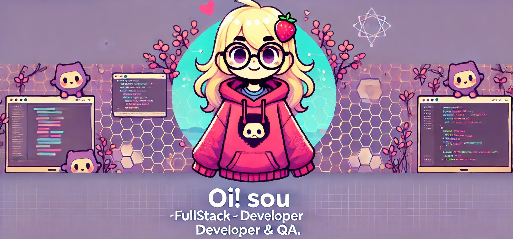

  

 

 
 

## 🚀 Sobre Mim

Olá! Sou uma **Desenvolvedora Full Stack & QA** especializada em criar **soluções web de alta performance** utilizando **PHP 8.4**. Minha experiência abrange desde a construção de **frameworks MVC próprios** até a **implementação de soluções seguras e escaláveis**, sempre com foco em **alta performance**, **arquitetura limpa** e **automação de testes**.

### 💡 Princípios de Desenvolvimento
- 🔒 **Segurança**: Autenticação segura, Prepared Statements, tratamento de erros com exceções.
- 📂 **Estruturas de Código**: Arquitetura de baixo acoplamento, coesão elevada, e injeção de dependência.
- 💡 **Boas Práticas**: Código limpo, tipagem forte e simplificação de estruturas de pastas.

### 🛠️ Tecnologias & Ferramentas

#### **Desenvolvimento**
- **PHP 8.4** 💻
- **Docker** 🐳
- **MariaDB** 💾
- **jQuery** ✨
- **Bootstrap** 📱
- **Composer v2** ⚙️  

#### **Qualidade & Automação**
- **Cypress** 🧪 para testes automatizados
- **Metodologias de Testes Automatizados** 📊
- **CI/CD** 🔄 para integração contínua e entrega

#### **Infraestrutura**
- **Docker** (Conteinerização) 🐋
- **Portainer** (Gerenciamento de containers) 📦
- **Traefik** (Roteamento e Proxy Reverso) 🔀

---

## 📊 Estatísticas do GitHub

---

## 🏆 **Projetos Destacados**
- [Portfólio Profissional](https://github.com/DevNayaraVieira/portfolio)  
  Portfólio pessoal desenvolvido com PHP 8.4, jQuery, Bootstrap 5 e MariaDB.  
  **Tecnologias**: PHP 8.4, MariaDB, Bootstrap 5, jQuery, Docker.
  - **Descrição**: Este portfólio exibe minhas habilidades em desenvolvimento web com foco em performance, design responsivo e otimização para acessibilidade.
- [Framework MVC](https://github.com/DevNayaraVieira/framework-mvc)  
  Um framework MVC personalizado desenvolvido com PHP 8.4, focado em performance e escalabilidade.
- [Automação de Testes com Cypress](https://github.com/DevNayaraVieira/automacao-cypress)  
  Suíte de testes end-to-end utilizando Cypress para garantir a qualidade do código.
- [Aplicação CRUD Completa](https://github.com/DevNayaraVieira/aplicacao-crud)  
  Sistema completo para gerenciamento de dados com funcionalidades CRUD (Create, Read, Update, Delete).
- [API RESTful com PHP e MySQL](https://github.com/DevNayaraVieira/api-restful)  
  API desenvolvida com PHP, implementando CRUDs de usuários, com autenticação via JWT.
- [E-commerce](https://github.com/DevNayaraVieira/e-commerce)  
  Sistema de e-commerce com carrinho de compras, pagamentos simulados e gerenciamento de produtos.

## 📫 **Contato**

  
  

### **Frase de Código**
*"Código limpo é mais do que funcionar. É sobre criar arte com lógica."*
